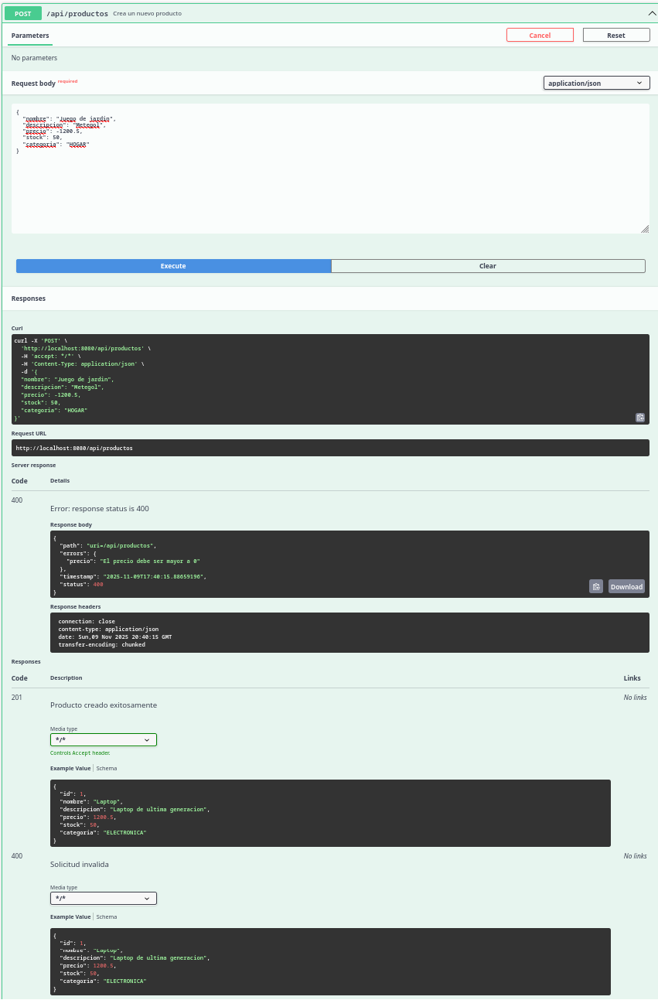
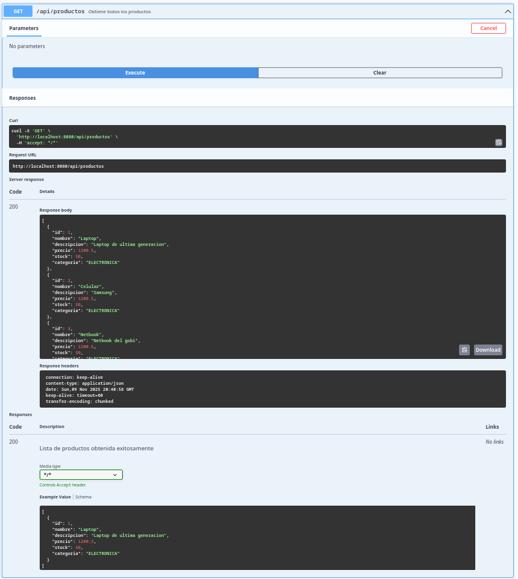
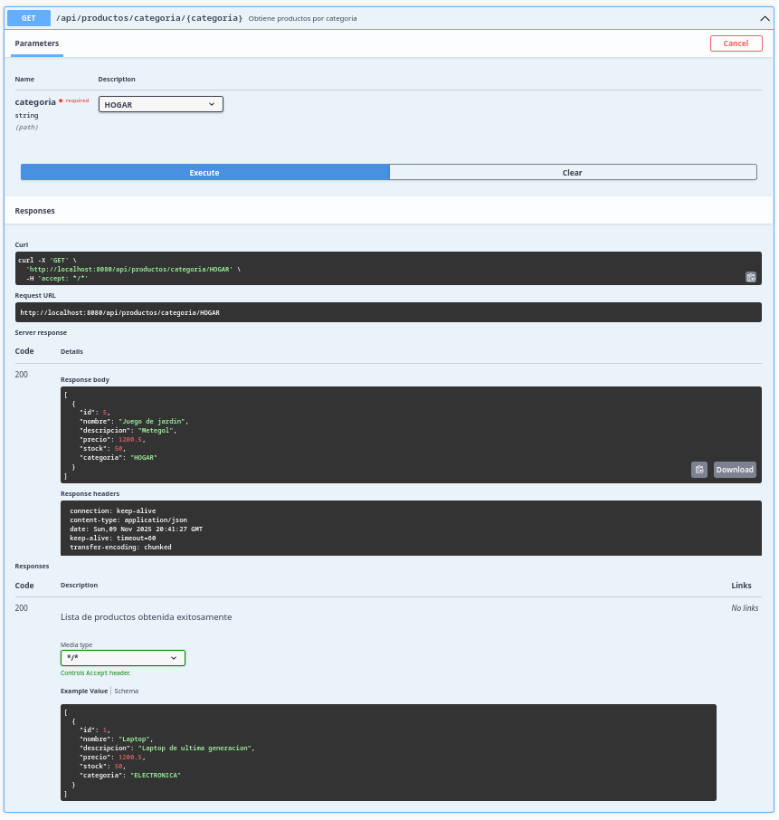
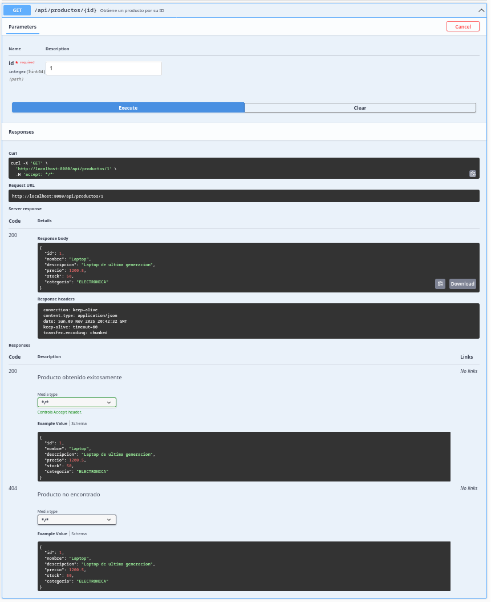
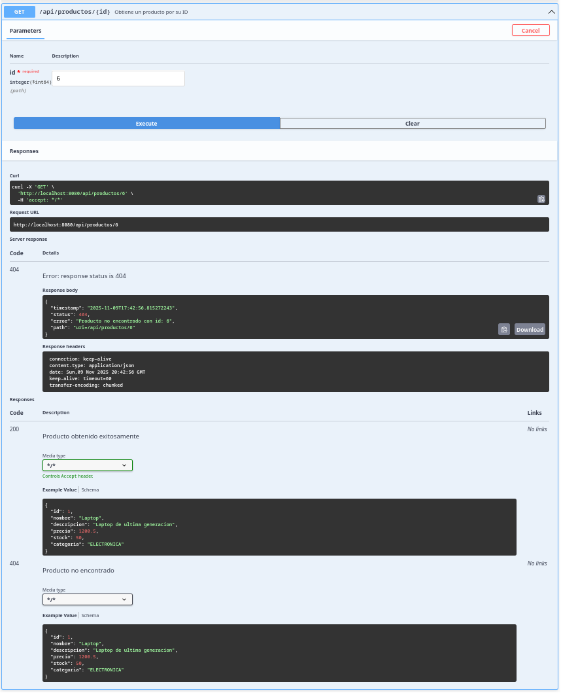
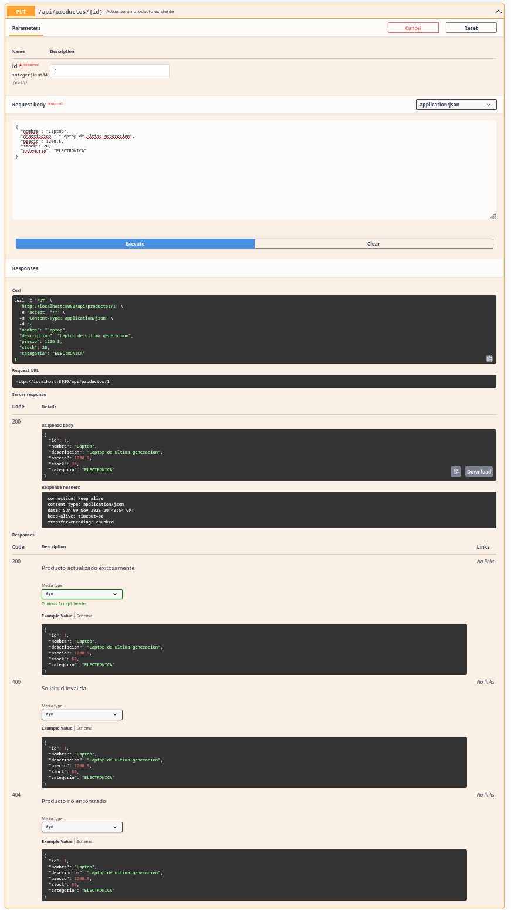
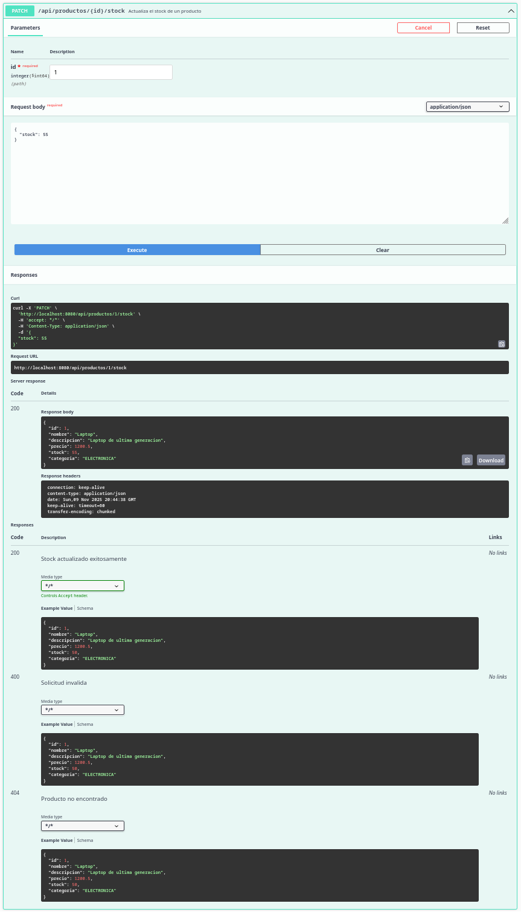
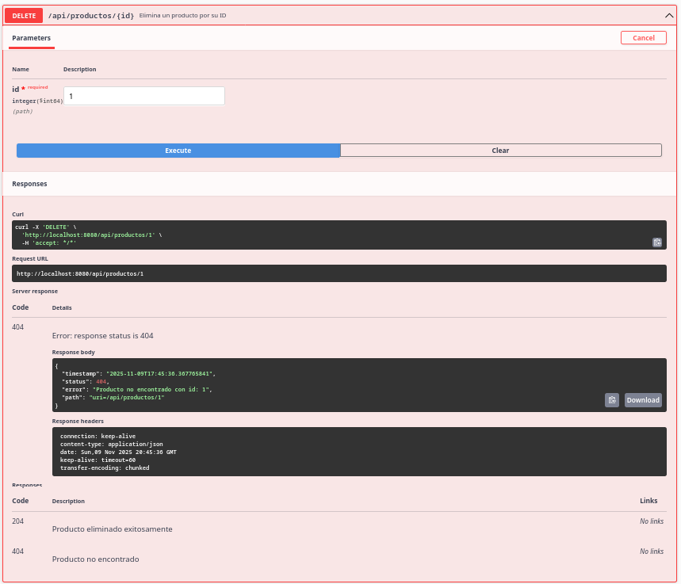
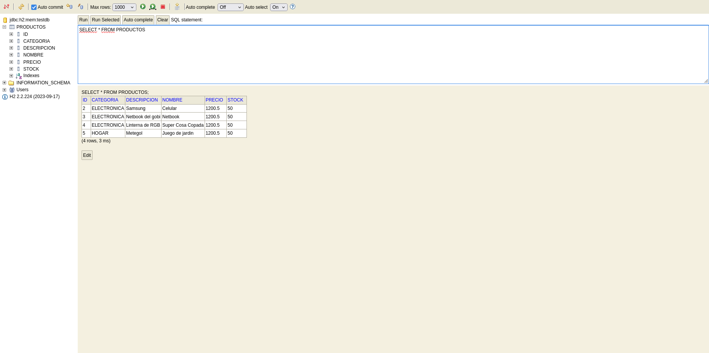

# API REST para Gestión de Productos

API REST completa y profesional para la gestión de productos, aplicando arquitectura en capas, validaciones, manejo de errores, persistencia con Spring Data JPA y documentación con Swagger.

## Tecnologías Utilizadas

*   **Spring Boot:** Framework para crear aplicaciones Java de manera rápida y sencilla.
*   **Spring Data JPA:** Para la persistencia de datos en una base de datos relacional.
*   **H2 Database:** Base de datos en memoria para un desarrollo y pruebas ágiles.
*   **Lombok:** Para reducir el código boilerplate en las clases de modelo.
*   **Bean Validation:** Para la validación de los datos de entrada.
*   **ModelMapper:** Para el mapeo de objetos entre DTOs y entidades.
*   **Springdoc OpenAPI (Swagger):** Para la documentación de la API.

## Instrucciones para Clonar y Ejecutar el Proyecto

1.  **Clonar el repositorio:**

    ```bash
    git clone https://github.com/sudogringo/ApiREST_SpringBoot
    ```

2.  **Navegar al directorio del proyecto:**

    ```bash
    cd productos-api
    ```

3.  **Ejecutar la aplicación:**

    ```bash
    ./mvnw spring-boot:run
    ```

    La aplicación estará disponible en `http://localhost:8080`.

## Endpoints de la API

| Método HTTP | Ruta                               | Descripción                                     |
|-------------|------------------------------------|-------------------------------------------------|
| `POST`      | `/api/productos`                   | Crea un nuevo producto.                         |
| `GET`       | `/api/productos`                   | Obtiene todos los productos.                    |
| `GET`       | `/api/productos/{id}`              | Obtiene un producto por su ID.                  |
| `GET`       | `/api/productos/categoria/{categoria}` | Obtiene productos por categoría.                |
| `PUT`       | `/api/productos/{id}`              | Actualiza un producto existente.                |
| `PATCH`     | `/api/productos/{id}/stock`        | Actualiza el stock de un producto.              |
| `DELETE`    | `/api/productos/{id}`              | Elimina un producto por su ID.                  |

## Acceso a Swagger UI

Para acceder a la documentación de la API generada por Swagger, abre tu navegador y ve a:

[http://localhost:8080/swagger-ui.html](http://localhost:8080/swagger-ui.html)

## Acceso a la Consola H2

Para acceder a la consola de la base de datos H2, sigue estos pasos:

1.  Abre tu navegador y ve a:

    [http://localhost:8080/h2-console](http://localhost:8080/h2-console)

2.  En la página de inicio de sesión de la Consola H2, asegúrate de que los siguientes ajustes estén configurados:
    *   **JDBC URL:** `jdbc:h2:mem:testdb`
    *   **User Name:** `sa`
    *   **Password:** (déjalo en blanco)

3.  Haz clic en el botón **Connect**.

## Capturas de Pantalla

*   Prueba exitosa de POST (creando producto)

*   Prueba de GET (listando productos y por categoría)


*   Error 404 cuando el producto no existe


*   Modificacion de datos


*   Borrado de producto

*   Consola H2 mostrando los datos persistidos


## Conclusiones Personales

Este proyecto proporcionó una comprensión integral de la construcción de API RESTful con Spring Boot, centrándose en las mejores prácticas como la arquitectura en capas, la validación de datos y un sólido manejo de errores. La implementación de características como la persistencia con Spring Data JPA y la documentación de la API con Swagger mejoró significativamente mis habilidades en el desarrollo de soluciones de backend escalables y mantenibles. En general, esta experiencia fue invaluable para consolidar mi conocimiento del desarrollo empresarial moderno con Java.
